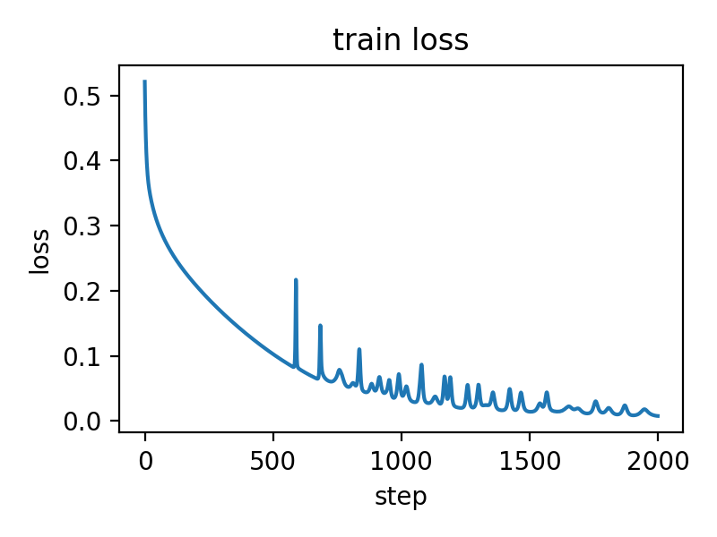
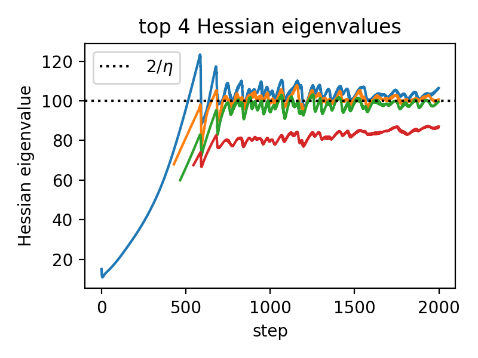
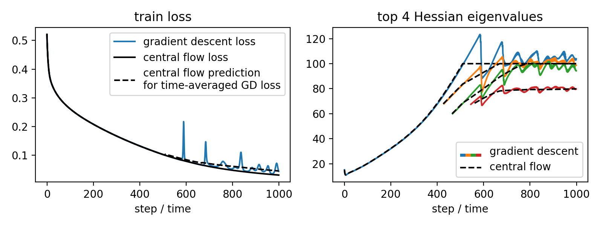
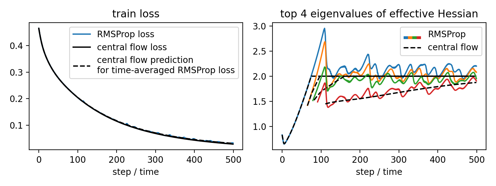

# Central Flows
This repository contains code for the paper [Understanding Optimization in Deep Learning with Central Flows](https://arxiv.org/abs/2410.24206) by Jeremy Cohen*, Alex Damian*, Ameet Talwalkar, Zico Kolter, and Jason Lee (* denotes equal contribution).


**Overview of important contents:**
 <!-- * We provide a [tutorial](notebooks/tutorial.ipynb) Jupyter notebook where we gradually work our way up to implementing the central flow for gradient descent. This is a good way to ease into the nitty gritty details. -->
* The script [minimal.py](minimal.py)  contains a minimalist / pedagogical implementation of the central flow for gradient descent ([documentation](docs/minimal.md)).
 * The script [main.py](main.py) is our main code for running central flows.  We used this code for our paper's experiments ([full documentation](docs/main.md)).  The quickstart below gives an introduction to using this code.

## Installation

Installation instructions can be found [here](docs/installation.md).

## Quickstart

Let's walk through how to use [main.py](main.py).

#### Step 1: running gradient descent

Let's say that we want to train an MLP on CIFAR-10 using gradient descent.  We can run the command:
```bash
python main.py opt:gd data:cifar10 arch:mlp --data.classes=4 --data.n=1000 --data.criterion=mse --opt.lr=0.02 --runs discrete --steps=1000
```

Here, `data:cifar10` specifies CIFAR-10 as the dataset; `arch:mlp` specifies MLP as the architecture; and `opt:gd` specifies gradient descent as the optimization algorithm.  Furthermore:
 - the arguments `--data.classes=4 --data.n=1000 --data.criterion=mse` designate that the dataset should be a subset of CIFAR-10 with four classes and 1000 examples in the training set, and that the loss criterion should be mean squared error (mse).
 - the argument `opt.lr=0.02` designates 0.02 as the learning rate (lr) for gradient descent.

 Finally, `--runs discrete` specifies that the discrete optimizer (as opposed to the stable flow or the central flow) should be run, and `--steps 1000` specifies that training should proceed for 1000 steps.

**The results**: After running the above command, the code will output (among other things) the relative path to the directory where the results are saved:
> Saving data to:  [overall experiment dir]/[random experiment ID]

This directory will contain a file `data.hdf5` which stores the experimental results in [HDF5 format](https://docs.h5py.org/en/stable/quick.html#quick).  The following code will print the train loss curve as a numpy array:
```python
import h5py
with h5py.File(PATH + "/data.hdf5", "r", libver="latest", swmr=True) as datafile:
  print(datafile['discrete']['train_loss'][:])
  # the operation [:] converts the HDF5 array to a numpy array

```
Note that we use `nan` as a placeholder value, so if you terminate the program early, 
the `train_loss` array will have nans for the steps that were never reached.
(Using `nan` as placeholder plays well with matplotlib; you can pass the whole array to matplotlib and it will just ignore the nans.)

Here is a plot of the train loss curve:

<p align="center">
  
</p>

You can see the other fields that were logged by calling
```python
datafile['discrete'].keys()
```

#### Step 2: compute Hessian eigenvalues

Let's say that, while running gradient descent, we want to compute the top Hessian eigenvalue ("sharpness") at each iteration.  To do this, we can add the argument `--eig.frequency=1` to the above command:
```bash
python main.py opt:gd data:cifar10 arch:mlp --data.classes=4 --data.n=1000 --data.criterion=mse --opt.lr=0.02 --runs discrete --steps=2000 --eig.frequency=1
```
By default, the code automatically tracks all eigenvalues of the Hessian that exceed the threshold 1.5 / LR, tracking new eigenvalues as needed.  You can change the threshold to something other than 1.5 (say, 1.75) by passing `--eig.track-threshold 1.75`.

The computed Hessian eigenvalues will be stored in a field `hessian_eigs`, which you can access like so:
```
datafile['discrete']['hessian_eigs'][:]
```
Note that for eigenvalues that we started to track in the middle of training, there will be nans before the step where we started to track that eigenvalue.

Here is a plot of the top Hessian eigenvalues:

<p align="center">
  
</p>

You can also initially track more than the single largest Hessian eigenvalue. For example, by passing the argument `--eig.initial-k 4` we could initially track the top 4 Hessian eigenvalues instead of just the top 1.

#### Step 3: run the central flow
Let's say that we want to run the central flow alongside the discrete gradient descent algorithm.  To do this, we can add `central` to the list of runs, i.e:
```bash
python main.py opt:gd data:cifar10 arch:mlp --data.classes=4 --data.n=1000 --data.criterion=mse --opt.lr=0.02 --runs discrete central --steps=1000 --eig.frequency=1
```
The experimental data from the discrete optimizer will be stored in `datafile['discrete]`, and the experimental data from the central flow will be stored in `datafile['central']`.  For example, the central flow's training loss will be stored in `datafile['central']['train_loss'][:]`, and the central flow's prediction for the time-averaged GD training loss will be stored in `datafile['central']['predicted_loss'][:]`.

The central flow tracks eigenvalues using similar logic as the discrete optimizer, i.e. it tracks all eigenvalues that are greater than `eig.track-threshold` / LR, where `eig.track-threshold` defaults to 1.5.

Here is a plot of the central flow:

<p align="center">
  
</p>

Note that we could also run the 'stable flow' (i.e. for gradient descent, the gradient flow) by adding `stable` to the list of runs.  That is, passing `--runs discrete central stable` would simultaneously run the discrete algorithm, the central flow, and the stable flow.

#### Step 4: other optimizers

Let's say that we want to use RMSProp rather than gradient descent.  We then change `opt:gd` to `opt:rmsprop` and change `--opt.lr=0.02` to the RMSProp hyperparameters.  For example:
```bash
python main.py opt:rmsprop data:cifar10 arch:mlp --data.classes=4 --data.n=1000 --data.criterion=mse --opt.lr=2e-5 --opt.beta2=0.99 --opt.eps=1e-7 --opt.bias-correction --runs discrete central --steps=500 --eig.frequency=1 --warm-start 5 --eig.track-threshold 1.75
 ```
 Here, `--warm-start n` causes `n` steps of training to be performed before the main loop begins.  This is useful because for this network, the effective sharpness is very large (greater than 2) at initialization, due to the preconditioner being small, but within the first 5 steps of training, it goes down to well below 2.

 Here is a plot of the central flow for RMSProp:

 <p align="center">
  
</p>

That's all!  You now understand the basics.  Here are some finer points:

#### Additional functionality
 - **Midpoint process**: when running the discrete optimizer, it can be useful to measure the loss, gradient norm, and Hessian eigenvalues not just at the iterates themselves, but also at the "second-order midpoints" $\{w^*_t\}$ of the iterates $\{w_t\}$, defined as:

<p align="center">
  
</p>

 This 'averages out' most of the oscillations along the top Hessian eigenvectors.  To support this, we have implemented a `midpoint` process whose iterates are the midpoint iterates $\{w^*_t\}$ of the discrete process.   In other words, if you add `midpoint` to the list of runs, then the entry `datafile['midpoint']['train_loss'][:]` in the data file will contain the training loss, for example, measured at these midpoints.
  
  Continually re-computing the Hessian eigenvalues at the actual discrete iterates can be much more computationally expensive than computing the Hessian eigenvalues at the midpoint iterates, since the oscillatory motion makes the warm-starts less effective, necessitating more solver iterations to reach a fixed tolerance.  If you're running both `discrete` and `midpoint` and would like to only compute the Hessian eigenvalues at the midpoints, you can pass `--eig.frequency 1 --discrete.eig.frequency -1`; this will set a global eig frequency of 1 but then override it for the discrete process.
 - **Checkpointing**: the code supports saving and loading from checkpoints.  The checkpoints will be saved in the "checkpoints" subdirectory of the experiment directory.  Each checkpoint contains the state for all processes. To save a checkpoint every $k$ iterations, pass `--checkpoint.frequency k`.   To save checkpoints at a fixed list of iterations, pass `--checkpoint.steps iteration1 iterations2 iteration3` etc.    To initialize from a checkpoint at location "path", pass `--checkpoint-file path`.

Complete documentation for [main.py](main.py) can be found [here](docs/main.md).
